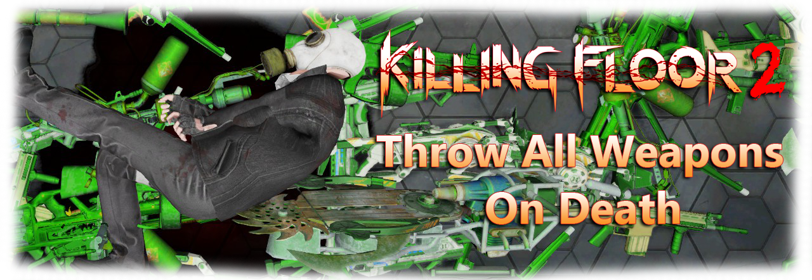

A small mutator that forces players to throw all their weapons on death (not just the current weapon as in the game by default). 

# Build
1. Install [Killing Floor 2](https://store.steampowered.com/app/232090/Killing_Floor_2/), Killing Floor 2 - SDK and [git for windows](https://git-scm.com/download/win);
2. Open git-bash, clone this repository and go to the source folder:  
`git clone https://github.com/GenZmeY/KF2-TAWOD && cd KF2-TAWOD`  
3. Run make.sh script:  
`./make.sh --compile`  
4. The compiled files will be here:  
`C:\Users\<USERNAME>\Documents\My Games\KillingFloor2\KFGame\Unpublished\BrewedPC\Script\`  

# Testing
You can check your build using the `make.sh` script.  
Open git-bash in the source folder and run the script:  
`./make.sh --test`  
On first launch, the script will create `testing.ini` file and launch the game with the settings from it (KF-Outpost map + TAWODMut). Edit this file if you need to test the mutator with different parameters.

# Usage (Server)
1. Open your PCServer-KFEngine.ini / LinuxServer-KFEngine.ini;  
2. Add the following string to the [OnlineSubsystemSteamworks.KFWorkshopSteamworks] section:  
`ServerSubscribedWorkshopItems=2379769040`  
3. Start the server and wait while the mutator is downloading;  
4. Add the following line to the startup parameters and restart the server:  
`?Mutator=TAWOD.TAWODMut`  

# Bug reports
If you find a bug, create new issue here: [Issues](https://github.com/GenZmeY/KF2-TAWOD/issues)  
Describe what the bug looks like and how to reproduce it.  

# License
The mutator is licensed under the [GNU GPLv3](LICENSE).
